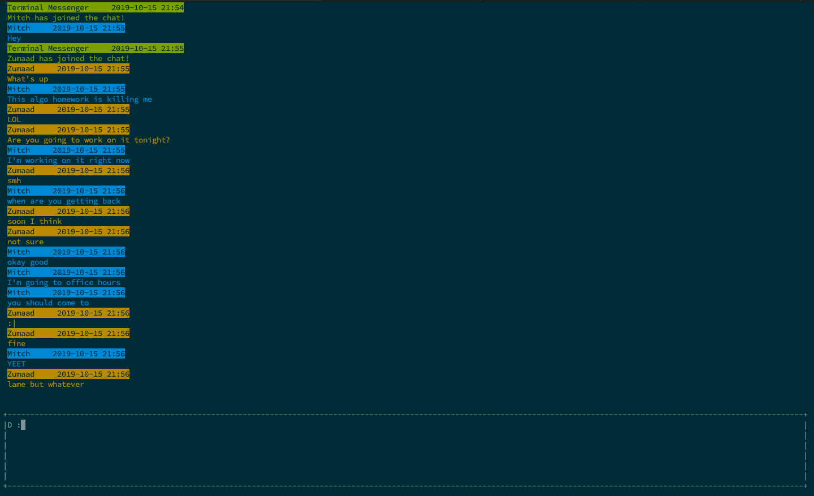
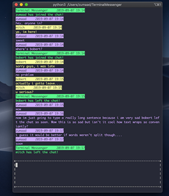

# The Terminal Messenger #

A centralized messaging service available right in your terminal. Now, you never have to leave your workspace again.

We created a TCP server to relay messages back and forth between multiple users in a singular chatroom, and created a basic terminal UI with the NCURSES library. Basic test suite and `pylint` passing. 

Persistent messages coming soon! Once we stop re-implementing it... :eyes:

 
<!-- .element style="height: 400%; width: 400%" -->

## Backstory
This project began as a quick test. After both of us had some web development experience under our belts, we wanted a better understanding of how the underlying infrastructure of the web works. So, we began working on a small messaging service to communicate with each other. And it spiralled from there.

## Core Features ##
- [ ] message one on one with another client
- [ ] group messaging
	- [ ] public forums anyone can read and write messages to
	- [ ] private chatrooms which users add other users to
- [x] add names to messages
- [ ] Persistence
	- [ ] accounts for users
	- [ ] message history
- [ ] multi threaded server (for things like handling client handshake in own function, handling even more messages/chatrooms,etc)
	- [ ] handling a client-server handshake
	- [ ] better performance and management for multiple messages/chatrooms
- [ ] keyboard shortcuts/hotkeys
  - [ ] 'ctrl-z', 'ctrl-u', etc
- [ ] restructuring project to follow a legitimate package and API (logging class, better import system, class and configuration)
    - [ ] run tests out of one file/command

## Bonus Features ##
### DevOps ###
- [ ] packaging it with pypy
- [ ] dockerize it 
- [ ] have different subdomains for the different services of our application (e.g. http server)
- [ ] script to scrape for all errors in server.log, or a certain number of them, like tail for errors (sed?)
- [ ] horizontal scaling with a load balancer
- [x] add a domain name
- [ ] comply with ICMP protocol to allow for 'ping'
### Terminal Client ###
- [x] formatting with ncurses
- [ ] adding useful text commands (/join to join a chatroom, /l to list public chatrooms)
- [ ] image rendering 
- [ ] text search for previous messages
- [x] message scroll
- [ ] mouse up to get past messages and load previous messages on scroll
- [ ] scrollable input area for long messages
- [ ] input autocomplete(?)
- [ ] emojis
- [ ] split terminal for multiple chatrooms
- [ ] autocomplete for text commands
- [ ] sidebar with metadata for chatroom and options for interacting with multiple chatrooms
- [x] pretty colors :)
- [x] add messages for users that connected/disconnected to the chatroom
- [ ] speech recognition
- [ ] on sleep/disconnection, display 'disconnected' and try to reconnect on message send
- [ ] terminal multiplexer, work in the terminal on one pane and message in the other
- [ ] text formatting in input window: shift+\n for newline, etc.
### Terminal Server ###
- [ ] admin privileges to starters of group messages/chatrooms, etc.
- [ ] hidden file with username and password saved to not type in username and password every time (almost like a cookie)
- [ ] send messages to other endpoints (SMS, Facebook, Slack, etc)
- [ ] allow a user to specify how long their (or any other, perhaps) messages will persist for
### Security ###
- [ ] encryption
- [ ] security (blocking ips, etc)
- [ ] prevent injection/other exploits to server
- [ ] defend against unknown information/requests
### HTTP Server ###
- [x] **TEMP** static HTML page that we serve (with web server) about the project (until HTTP server server are established)
- [ ] user/message history
- [ ] Data analytics (possibly integrated with the client by default?)
- [ ] Full-text search
- [ ] and more?
### WebSockets Client ###
- [ ] gain the ability to send messages from terminal to browser client and vice versa
- [ ] create a desktop app to accompany the browser version of the client
- [ ] allow the ability to send images (convert images to ascii art for the terminal?)
- [ ] integrate all other terminal client features
